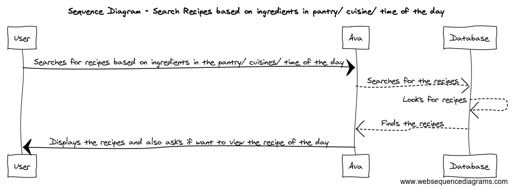

## AVA

### Table of contents  
* [Project Proposal](https://github.com/CSUS-CSC-131-Fall2017/ava/blob/master/docs/friday-proposal.md)
* [Customer Requirements](#requirements)
* [Glossary](#glossary)
* [Functional Requirments](#functional)
  * [Actors and Goals](#actor)
  * [Use Cases](#usecase)
  * [System Sequence Diagrams](#diagrams)

##  Customer Requirements                                  

| Requirements | Priority | Description                              |
| ------------ | -------- | ---------------------------------------- |
| REQ - 1      | 5        | Ava should be able to authenticate the user/register new users |
| REQ - 2      | 5        | Ava must let users add items to their pantry |
| REQ - 3      | 5        | Ava should be able to find a recipe      |
| REQ - 3a     | 5        | ...based on the ingredients              |
| REQ - 3b     | 4        | ...based on cuisine                      |
| REQ - 3c     | 3        | ...based on time-of-day                  |
| REQ - 4      | 3        | Ava will let users bookmark/save recipes |
| REQ - 5      | 2        | Ava will let users leave a review        |
| REQ - 5a     | 2        | ...by giving a rating (on a scale of 1-5), based on how much they liked it |
| REQ - 5b     | 2        | ...by giving a suggestion in text/comment |
| REQ - 6      | 1        | Ava will let users view recipe of the day |
| REQ - 7      | 1        | Ava will let users share their recipes   |
| REQ - 8      | 1        | Ava analyzes recipes and provides related side dishes to make a full meal |

##  Use Case Diagram

##  System Sequence Diagrams

