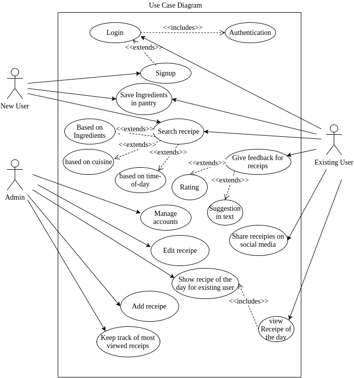
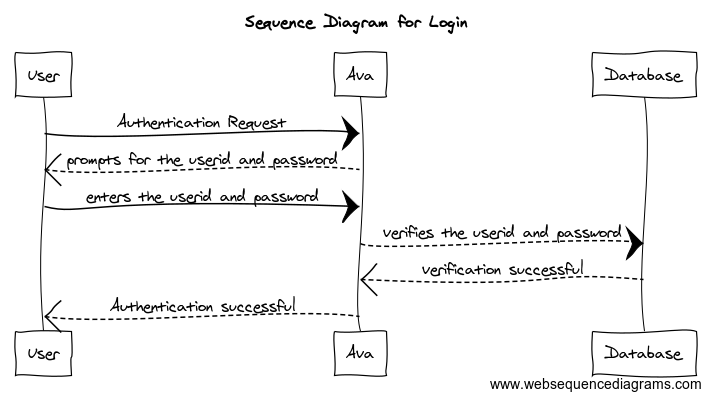
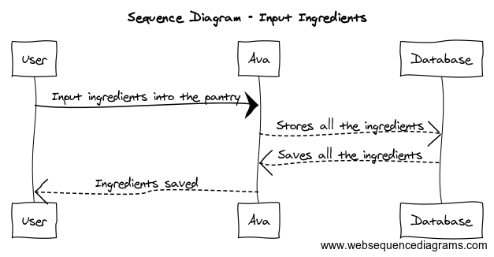
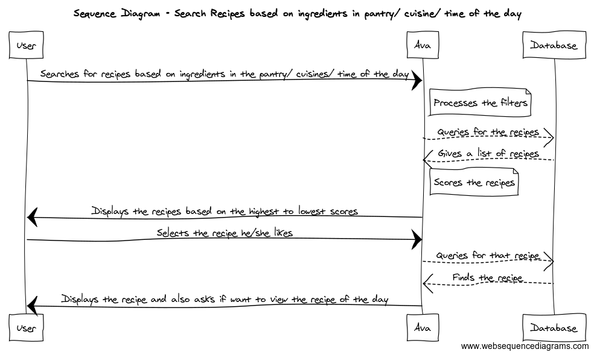
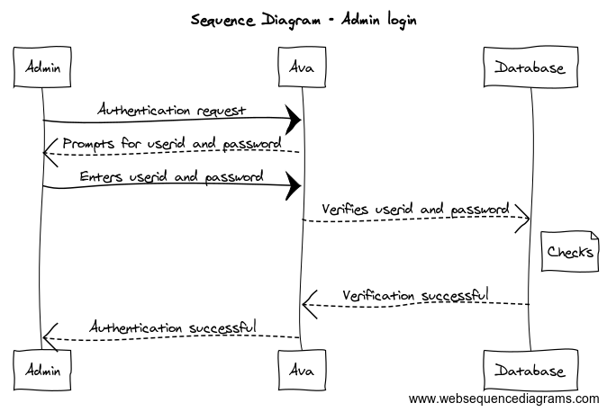

## AVA

### Table of contents  
* [Project Proposal](https://github.com/CSUS-CSC-131-Fall2017/ava/blob/master/docs/friday-proposal.md)
* [Customer Statement of requirements](https://github.com/CSUS-CSC-131-Fall2017/ava/blob/master/docs/Customer%20Statement%20of%20Requirements.md#customer-statement-of-requirements)
* [Requirements](#requirements)
* [Glossary](#glossary)
* [Functional Requirments](#functional)
  * [Actors and Goals](#actor)
  * [Use Cases](#usecase)
  * [System Sequence Diagrams](#diagrams)

##  Customer Requirements                                  

| Requirements | Priority | Description                              |
| ------------ | -------- | ---------------------------------------- |
| REQ - 1      | 5        | Ava should be able to authenticate the user/register new users |
| REQ - 2      | 5        | Ava must let users add items to their pantry |
| REQ - 3      | 5        | Ava should be able to find a recipe      |
| REQ - 3a     | 5        | ...based on the ingredients              |
| REQ - 3b     | 4        | ...based on cuisine                      |
| REQ - 3c     | 3        | ...based on time-of-day                  |
| REQ - 4      | 3        | Ava will let users bookmark/save recipes |
| REQ - 5      | 2        | Ava will let users leave a review        |
| REQ - 5a     | 2        | ...by giving a rating (on a scale of 1-5), based on how much they liked it |
| REQ - 5b     | 2        | ...by giving a suggestion in text/comment |
| REQ - 6      | 1        | Ava will let users view recipe of the day and admin should be aple to show recipe of the day to logged in users |
| REQ - 7      | 1        | Ava will let users share their recipes   |
| REQ - 8      | 1        | Ava analyzes recipes and provides related side dishes to make a full meal |
| REQ - 9      | 5        | Admin should be able to add or edit recipes and keep track of most viewed recipes |

##  Glossary

Ava: the system to be created; she will help a user as they navigate through the site

Pantry: a place to store all of the user's current ingredients; recipes will be found off of this information

##  Functional Requirements Specification

### 	 a. Stakeholders

### 	 b. Actors and Goals

### 	 c. Use Cases

#### 		 i. Casual Description

| Use Cases | Description                              |
| --------- | ---------------------------------------- |
| UC - 1    | NewUserSignUp New User can sign up to 'Ava' application |
| UC - 2    | LoginUser Existing user can login to 'Ava' application |
| UC - 3    | SaveIngredients User can save ingredients in the pantry |
| UC - 4    | SearchRecipe User can search recipes based on the search filter |
| UC - 5    | GiveFeedback Existing users can give feedback for recipes |
| UC - 6    | ShareRecipe Users can share recipes on social media |
| UC - 7    | ViewRecipeOfTheDay Users can view recipe of the day |
| UC - 8    | AddRecipe Admin can add recipe           |
| UC - 9    | EditRecipe Admin can edit recipe         |
| UC - 10   | DisplayRceipeOfTheDay Admin can show recipe of the day to logged in users |
| UC - 11   | Authenticate System should be able to validate existing users during login |
| UC - 12   | SearchFilter1 User should be able to search recipe using ingredients |
| UC - 13   | SearchFilter2 User should be able to search recipe using cuisine |
| UC - 14   | SearchFilter1 User should be able to search recipe based on time of the day |
| UC - 15   | FeedbackOption1 Logged in users can provide rating on a scale of 1 to 5 |
| UC - 16   | FeedbackOption2 Logged in users can provide suggestion in text for recipe |
| UC - 17   | ManageAccount Ava should be able to manage specific user account by analyzing recipes and provide related side dishes and let users bookmark or save recipe |
| UC - 18   | TrackMostViewed Admin should be able to track most viewed recipe |

#### 		 ii. Fully-Dressed Description

UC1 - NewUserSignUp 

Related Requirements: REQ - 1

Initiating Actor: User

Goal: User wants to get signed up for Ava application

Participating Actors: Ava

Preconditions: 

PostConditions: User is directed to the registration page in Ava 

Main Success Scenario:

    1.User opens the Ava application 

	2.User signs up by going to the registration page

	3.User submits the application and his/her account gets created

	4.Ava must be able to register new users

UC2 - LoginUser 

Related Requirements: REQ - 1

Initiating Actor: User,Ava

Goal: Existing user can login to Ava application

Participating Actors: Database

Preconditions: User must already have an account in Ava 

PostConditions: User is authenticated and user can go through Ava application 

Main Success Scenario:
​	 
    1.User gets logged in to Ava

	2.Ava must be able to authenticate the already existing users

	3.Users can view the Ava application 

​	
UC3 - SaveIngredients 

Related Requirements: REQ - 2

Initiating Actor: User,Ava

Goal: User can add/save items to their pantry 

Participating Actors: Database

Preconditions: New/Existing users can view the ingredients in pantry

PostConditions: User can view the ingredients which he/she has added to their pantry

Main Success Scenario:

	1.New/Existing users can browse the Ava application 

	2.User goes to the pantry mode

	3.User is given list of ingredients 

	4.User makes a selection

	5.User can add/save ingredients to their pantry 

UC4 - SearchRecipe 
​	
Related Requirements: REQ - 3

Initiating Actor: User,Ava

Goal: User can search any recipe 

Participating Actors: Database

Preconditions: User can view the ingredients in their pantry

PostConditions: User can view the ingredients which he/she has added to their pantry

Ava should be able to find a recipe

UC5 - GiveFeedback 

Related Requirements: REQ - 5

Initiating Actor: User,Ava

Goal: User can give feedback for any recipe

Participating Actors: Database

Preconditions: User must already have an account in Ava 

PostConditions: User can view any recipe and give feedback 

Main Success Scenario:

	1.User logs in to Ava

	2.User goes to the pantry mode

	3.User can view any recipe

	4.User gives feedback/review for the same

UC6 - ShareRecipe

Related Requirements: REQ - 7

Initiating Actor: User,Ava

Goal: User can share their recipes 

Participating Actors: Database

Preconditions: User must already have an account in Ava 

PostConditions: User can view any recipe and share it with others 

Main Success Scenario:

	1.User logs in to Ava

	2.User goes to the pantry mode

	3.User can view any recipe

	4.User shares the recipe 

UC7 - ViewRecipeOfTheDay 

Related Requirements: REQ - 6

Initiating Actor: User,Ava,Admin

Goal: User can view Recipe of the day

Participating Actors: Database

Preconditions: User must already have an account in Ava 

PostConditions: User can view Recipe of the day which the admin will show to the existing users

Main Success Scenario:

	1.User logs in to Ava

	2.Admin will show Recipe of the day to existing users

	3.Existing users can view Recipe of the day

UC8 - AddRecipe 

Related Requirements: REQ - 9

Initiating Actor: Ava,Admin

Goal: Admin should be able to add any recipe 

Participating Actors: Database

Preconditions: NA

PostConditions: A new gets added in the Ava application

Main Success Scenario:

	1.Admin can add any recipe whenever required

#### 		 iii. Use Case Diagram

####			 iv. System Requirements - Use Case Traceability Matrix 

|  Req  	| PW 	| UC1 	| UC2 	| UC3 	| UC4 	| UC5 	| UC6 	| UC7 	| UC8 	| UC9 	| UC10 	| UC11 	| UC12 	| UC13 	| UC14 	| UC15 	| UC16 	| UC17 	| UC18 	|
|:-----:	|:--:	|:---:	|:---:	|:---:	|:---:	|:---:	|:---:	|:---:	|:---:	|:---:	|:----:	|:----:	|:----:	|:----:	|:----:	|:----:	|:----:	|:----:	|:----:	|
|  REQ1 	|  5 	|  X  	|  X  	|     	|     	|     	|     	|     	|     	|     	|      	|   X  	|      	|      	|      	|      	|      	|      	|      	|
|  REQ2 	|  5 	|     	|     	|  X  	|     	|     	|     	|     	|     	|     	|      	|      	|      	|      	|      	|      	|      	|      	|      	|
|  REQ3 	|  5 	|     	|     	|     	|  X  	|     	|     	|     	|     	|     	|      	|      	|   X  	|   X  	|   X  	|      	|      	|      	|      	|
|  REQ4 	|  3 	|     	|     	|     	|     	|     	|     	|     	|     	|     	|      	|      	|      	|      	|      	|      	|      	|   X  	|      	|
|  REQ5 	|  2 	|     	|     	|     	|     	|  X  	|     	|     	|     	|     	|      	|      	|      	|      	|      	|   X  	|   X  	|      	|      	|
|  REQ6 	|  1 	|     	|     	|     	|     	|     	|     	|  X  	|     	|     	|   X  	|      	|      	|      	|      	|      	|      	|      	|      	|
|  REQ7 	|  1 	|     	|     	|     	|     	|     	|  X  	|     	|     	|     	|      	|      	|      	|      	|      	|      	|      	|      	|      	|
|  REQ8 	|  1 	|     	|     	|     	|     	|     	|     	|     	|     	|     	|      	|      	|      	|      	|      	|      	|      	|   X  	|      	|
|  REQ9 	|  5 	|     	|     	|     	|     	|     	|     	|     	|  X  	|  X  	|      	|      	|      	|      	|      	|      	|      	|      	|   X  	|

###  d. System Sequence Diagrams

Login

Add ingredients to Pantry

Search

Admin login 

##  Nonfunctional Requirements

Functionality - 

Usability-

Reliability-

Performance-

Supportability-