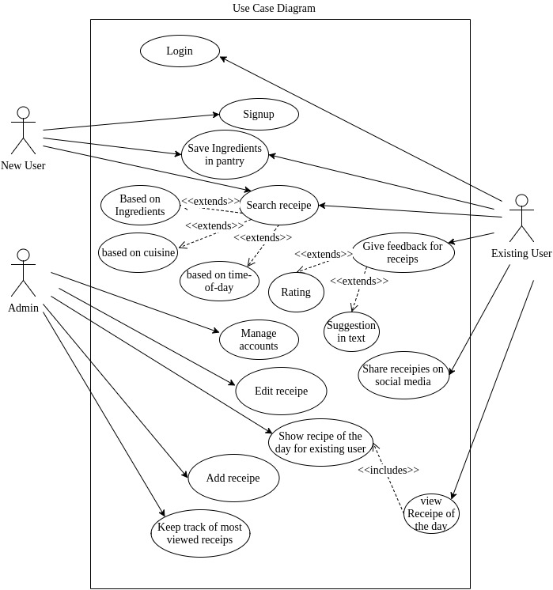
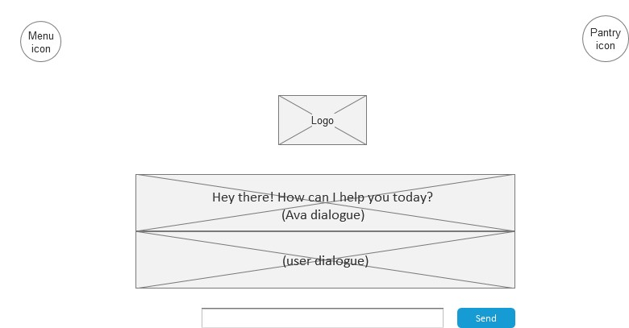
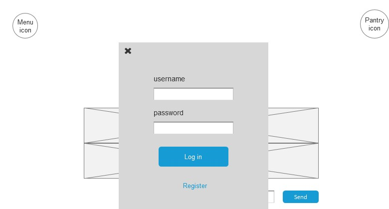
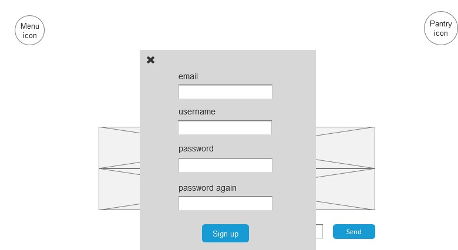
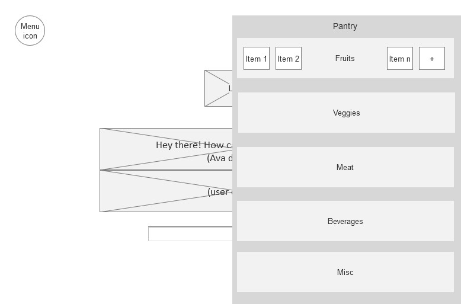
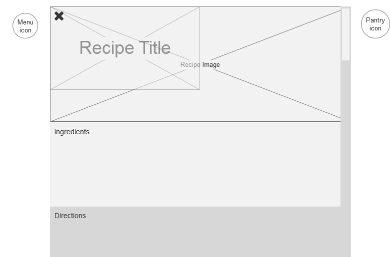

## AVA

### Table of contents  

**[Project Proposal](https://github.com/CSUS-CSC-131-Fall2017/ava/blob/master/docs/friday-proposal.md)**

**[Customer Statement of requirements](https://github.com/CSUS-CSC-131-Fall2017/ava/blob/master/docs/Customer%20Statement%20of%20Requirements.md#customer-statement-of-requirements)**

**[Requirements](#requirements)**

**[Glossary](#glossary)**

**[Functional Requirments](#functional)**

* [Stakeholders](#stakeholders)

* [Actors and Goals](#actor)
* [Use Cases](#usecase)
  * *[Casual description](#casualdescription)*
  * *[Fully dressed description](#fullydresseddescription)*
  * *[Use case diagram](#usecasediagram)*
  * *[Use case traceability matrix](#usecasetraceability)*
* [System Sequence Diagrams](#diagrams)

**[Non Functional requirements](#non_functional_requirements)**

**[Domain Analysis](#domain_analysis)**

* [Domain Model](#domain_model)
  * *[Concept definition](#concept_definition)*
  * *[Association Definitions](association_definitions)*
  * *[Attribute Definitons](attribute_definitions)*
* [System Operation Contracts](#operation_contracts)
* [Mathematical model](#mathematical_model)

**[User Interface design](#user_interface)**

* [Preliminary design](#preliminary_design)
* [User Effort estimation](#user_effort_estimation)

**[Plan of Work](#plan_of_work)**

**[References](#references)**

##  Customer Requirements                                  

| Requirements | Priority | Description                              |
| ------------ | -------- | ---------------------------------------- |
| REQ - 1      | 5        | Ava should be able to authenticate the user/register new users |
| REQ - 2      | 5        | Ava must let users add items to their pantry |
| REQ - 3      | 5        | Ava should be able to find a recipe      |
| REQ - 3a     | 5        | ...based on the ingredients              |
| REQ - 3b     | 4        | ...based on cuisine                      |
| REQ - 3c     | 3        | ...based on time-of-day                  |
| REQ - 4      | 3        | Ava will let users bookmark/save recipes |
| REQ - 5      | 2        | Ava will let users leave a review        |
| REQ - 5a     | 2        | ...by giving a rating (on a scale of 1-5), based on how much they liked it |
| REQ - 5b     | 2        | ...by giving a suggestion in text/comment |
| REQ - 6      | 1        | Ava will let users view recipe of the day and admin should be able to show recipe of the day to logged in users |
| REQ - 7      | 1        | Ava will let users share their recipes   |
| REQ - 8      | 1        | Ava analyzes recipes and provides related side dishes to make a full meal |
| REQ - 9      | 5        | Admin should be able to add or edit recipes and keep track of most viewed recipes |

##  Glossary

*Ava* : The system to be created; she will help a user as they navigate through the site.

*User* : Any person that uses the website to input ingredients to the pantry or searches for recipes based on the ingredients he/she has.

*Pantry* : A place to store all of the user's current ingredients; recipes will be found off of this information.

*Ingredients* : Edible items the user has in the pantry and the ones used to search for recipes.

*Admin* : A person who has deep access to the system, is capable of adding new recipes to the system; can view the user's pantry.

*Recipe of the Day* : Recommended recipe for the day by Ava.

##  Functional Requirements Specification

### 	 a. Stakeholders

The following people will be involved with the website:

- Teenagers

- Adults

### 	 b. Actors and Goals

#### User
- Able to sign in and create pantry

- Able to add their ingredients in the pantry

- Able to search recipes according to the category they want with the ingredients they have

#### Admin
- Able to manage the system

- Able to add new recipes to the system

- Able to view the homepage

- Able to view the user's pantry

  ###  c. Use Cases

  #### 	 i. Casual Description

| Use Cases | Description                              |
| --------- | ---------------------------------------- |
| UC - 1    | NewUserSignUp New User can sign up to 'Ava' application |
| UC - 2    | LoginUser Existing user can login to 'Ava' application |
| UC - 3    | SaveIngredients User can save ingredients in the pantry |
| UC - 4    | SearchRecipe User can search recipes based on the search filter |
| UC -4a    | SearchFilter1 User should be able to search recipe using ingredients |
| UC -4b    | SearchFilter2 User should be able to search recipe using cuisine |
| UC -4c    | SearchFilter3 User should be able to search recipe based on time of the day |
| UC - 5    | GiveFeedback Existing users can give feedback for recipes |
| UC -5a    | FeedbackOption1 Logged in users can provide rating on a scale of 1 to 5 |
| UC -5b    | FeedbackOption2 Logged in users can provide suggestion in text for recipe |
| UC - 6    | ShareRecipe Users can share recipes on social media |
| UC - 7    | ViewRecipeOfTheDay Users can view recipe of the day |
| UC - 8    | AddRecipe Admin can add recipe           |
| UC - 9    | EditRecipe Admin can edit recipe         |
| UC -10    | DisplayRceipeOfTheDay Admin can show recipe of the day to logged in users |
| UC -11    | ManageAccount Ava should be able to manage specific user account by analyzing recipes and provide related side dishes and let users bookmark or save recipe |
| UC -12    | TrackMostViewed Admin should be able to track most viewed recipe |

#### 		 ii. Fully-Dressed Description

#### UC1 - NewUserSignUp 

Related Requirements: REQ - 1

Initiating Actor: User

Goal: User wants to get signed up for Ava application

Participating Actors: Ava

Preconditions: None worth mentioning.

PostConditions: User is directed to the registration page in Ava 

Main Success Scenario:

    1.User opens the Ava application 

	2.User signs up by going to the registration page

	3.User submits the application and his/her account gets created

	4.Ava must be able to register new users

#### UC2 - LoginUser 

Related Requirements: REQ - 1

Initiating Actor: User,Ava

Goal: Existing user can login to Ava application

Participating Actors: Database

Preconditions: User must already have an account in Ava 

PostConditions: User is authenticated and user can go through Ava application.

Main Success Scenario:
​	 
    1.User gets logged in to Ava

	2.Ava must be able to authenticate the already existing users

	3.Users can view the Ava application 
​	
​	

#### UC3 - SaveIngredients 

Related Requirements: REQ - 2

Initiating Actor: User,Ava

Goal: User can add/save items to their pantry 

Participating Actors: Database

Preconditions: New/Existing users can view various ingredients

PostConditions: User can view the ingredients which he/she has added to their pantry.

Main Success Scenario:

	1.New/Existing users can browse the Ava application 

	2.User goes to the pantry mode

	3.User is given list of ingredients 

	4.User makes a selection

	5.User can add/save ingredients to their pantry 

​	

#### UC4 - SearchRecipe 

​	
Related Requirements: REQ - 3

Initiating Actor: User,Ava

Goal: User can search any recipe 

Participating Actors: Database

Preconditions: User can view the ingredients in their pantry

PostConditions: User can view the ingredients which he/she has added to their pantry

Main Success Scenario:
​		
		1.Ava should be able to find a recipe

#### UC - 4a SearchFilter1 

Related Requirements: REQ - 3

Initiating Actor:User,Ava

Goal: User should be able to search recipe using ingredients

Participating Actors: Database

Preconditions:  The user must have food items available to them checked in the Pantry.

PostConditions: User can browse recipes on website with their criteria.

Main Success Scenario:

	1.User can search any recipe based on the ingredients

#### UC - 4b SearchFilter2  

Related Requirements: REQ - 3

Initiating Actor:User,Ava

Goal: User should be able to search recipe using cuisine

Participating Actors: Database

Preconditions:  There is none worth mentioning.

PostConditions: Recipes will be listed based on their time of day keyword.

Main Success Scenario:
     1.User can search any recipe based on time of the day

#### UC - 4c SearchFilter3 

Related Requirements: REQ - 3

Initiating Actor:User,Ava

Goal: User should be able to search recipe based on time of the day

Participating Actors: Database

Preconditions:  No notable precondition.

PostConditions: The recipe list will show recipes with the associated time of day keyword.

Main Success Scenario:
     1.User should be able to search recipe based on time of the day		
#### UC5 - GiveFeedback 

Related Requirements: REQ - 5

Initiating Actor: User,Ava

Goal: User can give feedback for any recipe

Participating Actors: Database

Preconditions: User must already have an account in Ava 

PostConditions: User can view any recipe and give feedback 

Main Success Scenario:

	1.User logs in to Ava

	2.User goes to the pantry mode

	3.User can view any recipe

	4.User gives feedback/review for the same

#### UC - 5a FeedbackOption1 

Related Requirements: REQ - 5

Initiating Actor:User,Ava

Goal: Logged in users can provide rating on a scale of 1 to 5

Participating Actors: Database

Preconditions: User must have an account in Ava  

PostConditions: Rating is provided by the user for the recipe he/she viewed

Main Success Scenario:

	1.User views a recipe in Ava

	2.User wants to provide feedback by giving rating

	3.User gives rating for the recipe

#### UC - 5b FeedbackOption2

Related Requirements: REQ - 5

Initiating Actor:User,Ava

Goal: Logged in users can provide suggestion in text for recipe

Participating Actors: Database

Preconditions: User must have an account in Ava  

PostConditions: Suggestion for a recipe is added

Main Success Scenario:

	1.User views a recipe in Ava

	2.User wants to add a suggestion for a recipe

	3.User provides suggestion by adding text	
​	

#### UC6 - ShareRecipe

Related Requirements: REQ - 7

Initiating Actor: User,Ava

Goal: User can share their recipes 

Participating Actors: Database

Preconditions: User must already have an account in Ava 

PostConditions: User can view any recipe and share it with others 

Main Success Scenario:

	1.User logs in to Ava

	2.User goes to the pantry mode

	3.User can view any recipe

	4.User shares the recipe 

#### UC7 - ViewRecipeOfTheDay 

Related Requirements: REQ - 6

Initiating Actor: User,Ava,Admin

Goal: User can view Recipe of the day

Participating Actors: Database

Preconditions: User must already have an account in Ava 

PostConditions: User can view Recipe of the day which the admin will show to the existing users

Main Success Scenario:

	1.User logs in to Ava

	2.Admin will show Recipe of the day to existing users

	3.Existing users can view Recipe of the day

#### UC8 - AddRecipe 

Related Requirements: REQ - 9

Initiating Actor: Ava,Admin

Goal: Admin should be able to add any recipe 

Participating Actors: Database

Preconditions: NA

PostConditions: A new gets added in the Ava application

Main Success Scenario:

	1.Admin can add any recipe whenever required
#### UC9 - EditRecipe 

Related Requirements: REQ - 9

Initiating Actor:Ava,Admin

Goal: Admin should be able to edit any recipe

Participating Actors: Database

Preconditions: Recipe must be available in Ava  

PostConditions: Admin can make changes in recipe by editing it

Main Success Scenario:

	1.Admin searches for the recipe where changes should be made

	2.Admin can edit the recipe
​	

#### UC - 10 DisplayRecipeOfTheDay 

Related Requirements: REQ - 6

Initiating Actor:User,Ava,Admin

Goal: Ava will let users view recipe of the day and admin should be able to show recipe of the day to logged in users

Participating Actors: Database

Preconditions: User must have an account in Ava 

PostConditions: Users would be able to view recipe of the day

Main Success Scenario:

	1.Admin adds the recipe of the day 

	2.Users having account in Ava will be able to view the recipe of the day

#### UC - 11 ManageAccount 

Related Requirements: REQ - 4,REQ - 8

Initiating Actor:User,Ava,Admin

Goal: Ava should be able to manage specific user account by analyzing recipes and provide related side dishes and let users bookmark or save recipe

Participating Actors: Database

Preconditions:  User has verified account. 

PostConditions: Users would be able to view side dishes

Main Success Scenario:

	1.Ava analyzes user's recipe to manage specific user account

	2.Based on user's preferences,Ava provides related side dishes

	3.Ava allows users to bookmark or save recipe

#### UC - 12 TrackMostViewed 

Related Requirements: REQ - 9

Initiating Actor:User,Ava,Admin

Goal: Admin should be able to add or edit recipes and keep track of most viewed recipes

Participating Actors: Database

Preconditions:  

PostConditions: Admin would know the most active users and less active users

Main Success Scenario:

	1.Admin analyzes users and keeps track of the most viewed recipe
​	

#### 		 iii. Use Case Diagram

####			 iii. Use Case Traceability Matrix

|  Req  	| PW 	| UC1 	| UC2 	| UC3 	| UC4 	| UC5 	| UC6 	| UC7 	| UC8 	| UC9 	| UC10 	| UC11 	| UC12 	| UC13 	| UC14 	| UC15 	| UC16 	| UC17 	| UC18 	|
|:-----:	|:--:	|:---:	|:---:	|:---:	|:---:	|:---:	|:---:	|:---:	|:---:	|:---:	|:----:	|:----:	|:----:	|:----:	|:----:	|:----:	|:----:	|:----:	|:----:	|
|  REQ1 	|  5 	|  X  	|  X  	|     	|     	|     	|     	|     	|     	|     	|      	|   X  	|      	|      	|      	|      	|      	|      	|      	|
|  REQ2 	|  5 	|     	|     	|  X  	|     	|     	|     	|     	|     	|     	|      	|      	|      	|      	|      	|      	|      	|      	|      	|
|  REQ3 	|  5 	|     	|     	|     	|  X  	|     	|     	|     	|     	|     	|      	|      	|   X  	|   X  	|   X  	|      	|      	|      	|      	|
|  REQ4 	|  3 	|     	|     	|     	|     	|     	|     	|     	|     	|     	|      	|      	|      	|      	|      	|      	|      	|   X  	|      	|
|  REQ5 	|  2 	|     	|     	|     	|     	|  X  	|     	|     	|     	|     	|      	|      	|      	|      	|      	|   X  	|   X  	|      	|      	|
|  REQ6 	|  1 	|     	|     	|     	|     	|     	|     	|  X  	|     	|     	|   X  	|      	|      	|      	|      	|      	|      	|      	|      	|
|  REQ7 	|  1 	|     	|     	|     	|     	|     	|  X  	|     	|     	|     	|      	|      	|      	|      	|      	|      	|      	|      	|      	|
|  REQ8 	|  1 	|     	|     	|     	|     	|     	|     	|     	|     	|     	|      	|      	|      	|      	|      	|      	|      	|   X  	|      	|
|  REQ9 	|  5 	|     	|     	|     	|     	|     	|     	|     	|  X  	|  X  	|      	|      	|      	|      	|      	|      	|      	|      	|   X  	|

###  d. System Sequence Diagrams

Login

Add ingredients to Pantry

Search

Admin login 

##  Nonfunctional Requirements

**Functionality** - The system shows varies recipes that the users can try with the ingredients they provide. Users are able to use the system without signing up but they won't be able to save their ingredients or recipe for future use. 

**Usability**- This is a simple and user-friendly site; therefore, we assume the user will have a basic understanding of computer processes. User interface will be easy to learn and easy to manage for user and administration. 

**Reliability**- A reliable system will need to be maintained in order for our users be able to use the site regularly, whenever they need to and the system will also need to be secure so our users feel safe inputting their information when making and submitting an account. In the event of failure, the system may be restarted. 

**Performance**- Based on either ingredients in the pantry or ingredients inputted by the user, the search results displayed should be recipes that are closely related to the specified ingredients available to the user. 

**Supportability**- The system will be maintain by the administration. The system will be extended when searching for a recipe; a recipe can be searched based on ingredients, time-of-day, or cuisine. The system will also be extended when allowing the user to give feedback; the user may give feedback through a comment or a rating. 

**Implementation**- are there constraints on the hardware platform? are constraints imposed by the maintenance team? by the testing team?

**Interfaces**- should the system interact with any existing systems? how are data exported/imported into the system? what standards in use by the client should be supported by the system?

**Operation**- The administration will manage the system by adding new recipes to the system, show recipe of the day to users, and track the most viewed recipe. 

**Packaging**- The user will not need to install the system, it will be available online to anyone who wants to make an account or simply just browse the site. 

**Legal**- As of right now, the system will not be licensed. There are no liability issues/royalties to discuss.

##  Domain Analysis

###  Domain Model

####  i. Concept Definition

| Responsibility Description               | Type | Concept Name  |
| ---------------------------------------- | ---- | ------------- |
| R-01: Knows which registered users are accessing website, knows most accessed recipes. | K    | Admin         |
| R-02: Adds/deletes recipes, approves feedback, picks recipe of the day. | D    | Admin         |
| R-03: Adds ingredients to pantry, search recipes, must register to save ingredients. | D    | NewUser       |
| R-04: Adds ingredients to pantry, search recipes, edit personal account, adds feedback. | D    | ExistingUser  |
| R-05: Recipe modified, added, or deleted from website. | D    | ModifyRecipe  |
| R-06: Recipe with user specifications will be pulled from database | K    | SearchRecipe  |
| R-07: User will be able to add ingredient to their individual pantry. | D    | AddIngredient |
| R-08: Feedback will be added to recipe page. | D    | GetFeedback   |
| R-09: Daily recipe will be added to top of search. | D    | DailyRecipe   |
| R-10: Share recipe to social media.      | D    | ShareRecipe   |

####  ii. Association Definitions

####  iii. Attribute Definitions

###  System Operation Contracts

| Operation      | NewUserSignUp                            |
| -------------- | ---------------------------------------- |
| Precondition   | N/A                                      |
| Post-condition | User is directed to the registration page in Ava |

| Operation      | LoginUser                                |
| -------------- | ---------------------------------------- |
| Precondition   | User must already have an account in Ava |
| Post-condition | User is authenticated and user can use Ava site |

| Operation      | SaveIngredients                          |
| -------------- | ---------------------------------------- |
| Precondition   | Users can view various ingredients       |
| Post-condition | Users can view ingredients that have been added to their panty |

| Operation      | SearchRecipe                             |
| -------------- | ---------------------------------------- |
| Precondition   | User has ingredients in their pantry     |
| Post-condition | User can find a recipe related to search criteria |

| Operation      | GiveFeedback                             |
| -------------- | ---------------------------------------- |
| Precondition   | User must have an account in Ava         |
| Post-condition | User can view any recipe and give feedback on that recipe |

| Operation      | ShareRecipe                              |
| -------------- | ---------------------------------------- |
| Precondition   | User must have an account in Ava         |
| Post-condition | User can view any recipe and share it with their friends |

| Operation      | ViewRecipeOfTheDay                       |
| -------------- | ---------------------------------------- |
| Precondition   | User must have an account in Ava         |
| Post-condition | User can view the recipe of the day (posted by admin) |

| Operation      | AddRecipe                    |
| -------------- | ---------------------------- |
| Precondition   | N/A                          |
| Post-condition | A new recipe is added to Ava |

| Operation      | EditRecipe                             |
| -------------- | -------------------------------------- |
| Precondition   | Recipe must be available in Ava        |
| Post-condition | Said recipe is edited by Administrator |

| Operation      | DisplayRecipeOfDay                       |
| -------------- | ---------------------------------------- |
| Precondition   | User must have an account in Ava         |
| Post-condition | User will be able to see the recipe of the day |

| Operation      | ManageAccount                            |
| -------------- | ---------------------------------------- |
| Precondition   | N/A                                      |
| Post-condition | Users would be able to view side dish suggestions |

###  Mathematical Model

The search for the recipe will result in four suggestions (paginated in a carousal), the top being the most relevant result based on the user search. The recipes matching the search/ingredients must be therefore rated in order to sort and send back the most relevant results. 

The factors based on user search includes:

* Number of matching ingredients from pantry/search (m)
* Ingredients needed for the recipe (i)
* Ava rating (a)
* User rating (u)
  initial_search_score(for a recipe) x = (m/i) +  ( a/10 * 0.75) + (u/10 * 0.25) 

Furthermore, particular to a recipe, the relevancy algorithm/formula will therefore work on these factors:

- Intensity of spices (s)

- Calories (c)

- Carbs content (b)

- Temperature (t)

- Meat content (m)

- Texture (t)

  ​

  For each of the recipe in the database, all the above mentioned factors will have a numerical value on the scale of 1 to 10. 

  ​

  **relevancy_score** (for a recipe) y = x * 0.90 + {  (0.5) ^ [(s + c + b + t + m + t) / 60] } * 0.1

  ​

##  User Interface Design

###  Preliminary Design

###### Home/Dashboard

###### Login

###### Register

###### Pantry

###### Recipe

###  User Effort Estimation

1. Home/Dashboard
   1. Click "menu icon"
   2. Click "Log on icon"
   3. Click "send" to talk with Ava
2. Login
   1. After entering in information, click "Log in"
3. Register
   1. If user does not have a current account, they click "register"
   2. After entering in information, click "sign up"
4. Pantry
   1. Click on the "pantry" icon to access pantry
   2. Click on the "item(s)" to add to each food group
5. Recipe
   1. After searching for recipe, click on "desired recipe" for more information about it

##  Plan of Work

##  References
