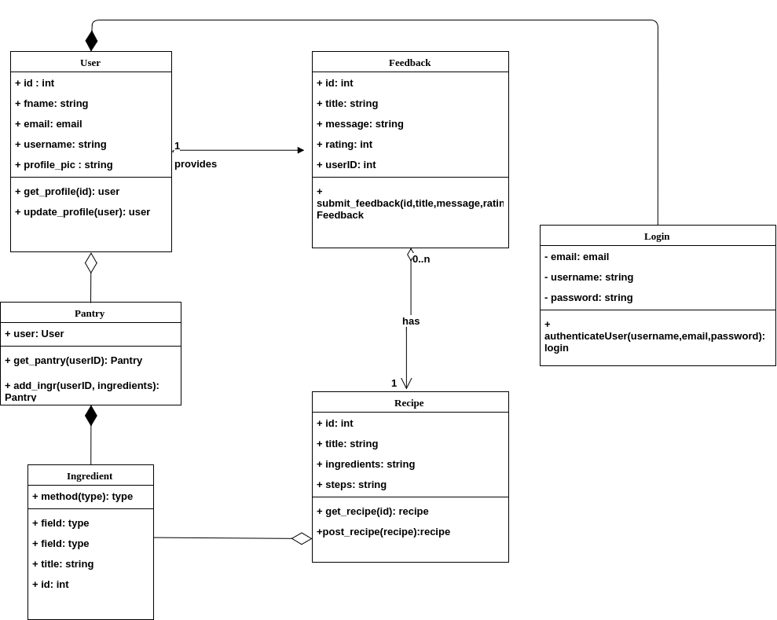

## AVA

### Table of contents  

**[Interaction Diagrams]()**

**[Class Diagram and Interface Specification]()**

* [Class Diagram](#classdiagram)
* [Data Types and Operation Signatures](#classdiagram)

**[System Architecture and System Design](#systemdesign)**

* [Architectural Styles](#architecturalstyles)
* [Identifying Subsystems](#identifyingsystems)
* [Mapping subsystems to Hardware](#hardwaremappings)
* [Persistent Data Storage](#datastorage)
* [Network Protocol](#networkprotocol)
* [Global Control Flow](#controlflow)
* [Hardware Requirements](#hardwarerequirements)

**[Algorithms and Data Structures](#algorithmsandstructures)**

* [Algorithms](#algorithms)
* [Data Structures](#datastructures)

**[User Interface Design and Implementation](#uidesign)**

**[Progress Report and Plan of Work](#progress)**

* [Progress Report](#progressreport)
* [Plan of Work](#planofwork)
* [Breakdown of Responsibilities](#breakdown)

**[References](#references)**

##  Interaction diagram

##  Class diagram

=======

##  System Architecture and system design

#### Architectural Styles

##### Client-server (Distributed application)

.jpg)

The **client–server model** is a distributed application structure that partitions tasks or workloads between the providers of a resource or service, called servers, and service requesters, called clients. Often clients and servers communicate over a computer network on separate hardware, but both client and server may reside in the same system. A server host runs one or more server programs which share their resources with clients. A client does not share any of its resources, but requests a server's content or service function. Clients therefore initiate communication sessions with servers which await incoming requests.

##### Server-side internal architecture

##### Major system services :

- user authentication 

- user pantry management

- user profile

- recipe search 

- recipe ratings and feedback

  ​

  In general, a service is an abstraction of computer resources and a client does not have to be concerned with how the server performs while fulfilling the request and delivering the response. The client only has to understand the response based on the well-known application protocol, i.e. the content and the formatting of the data for the requested service.

  ​

#### Identifying subsystems

##### Subsystems

* Frontend
* Application server
* Database

#### Data Storage

The system works with multiple storage strategies for different forms of data. For persistent data storage, the system uses *postgresql*-  object-relational database management system (ORDBMS) with an emphasis on extensibility and standards compliance.  PostgreSQL is developed by the PostgreSQL Global Development Group, a diverse group of many companies and individual contributors. It is free and open-source, released under the terms of the PostgreSQL License, a permissive software license.

The major differences between conventional rdbms services- MySQL and postgresql are as below : 

**Partitioning**

MySQL and PostgreSQL differ significantly with respect to their partitioning methods, which determine how data is stored on different nodes of the database. MySQL uses a proprietary technology called MySQL Cluster to perform horizontal clustering, which consists of creating multiple clusters with a single cluster instance within each node. PostgreSQL doesn’t implement true partitioning, although it can provide a similar capability with table inheritance. This task involves using a separate sub-table to control each “partition.”

**Replication**

A database may use multiple methods to store redundant data across multiple nodes. MySQL uses master-master replication, in which each node can update the data. Both MySQL and PostgreSQL can perform master-slave replication, where one node controls the storage of data by the other nodes. PostgreSQL can also handle other types of replication with the implementation of third-party extensions.

#### Network Protocol

Clients and servers exchange messages in a request–response messaging pattern. The client sends a request, and the server returns a response. This exchange of messages is an example of inter-process communication. To communicate, the computers must have a common language, and they must follow rules so that both the client and the server know what to expect. The language and rules of communication are defined in a communications protocol. All client-server protocols operate in the application layer. The application layer protocol defines the basic patterns of the dialogue. To formalize the data exchange even further, the server implements an application programming interface (API). The API is an abstraction layer for accessing a service. By restricting communication to a specific content format, it facilitates parsing. By abstracting access, it facilitates cross-platform data exchange via HTTP. 

#### Global Control Flow

#### Hardware Requirements

System interaction will require:

* Client device [ personal computer, laptop, smartphone]
* Web browser
* Internet connection

##  Algorithms and Data Structures

#### Algorithms

#### Data Structures

##  User Interface Design and Implementation

##  Progress

#### Progress report

#### Plan of work

#### Breakdown of Responsibilities

#### 

#### 