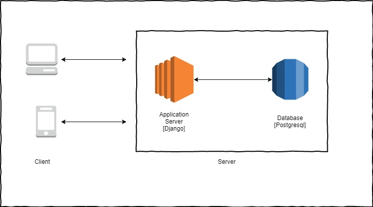
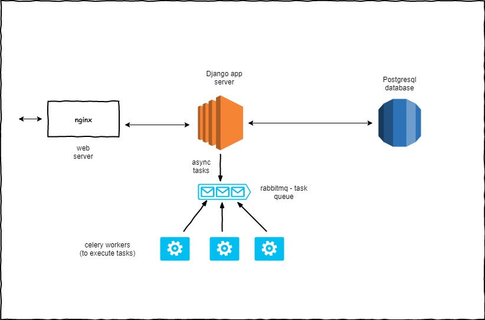
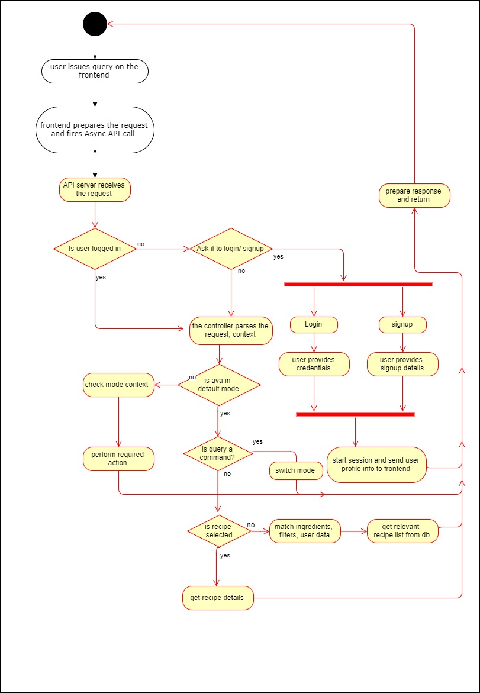
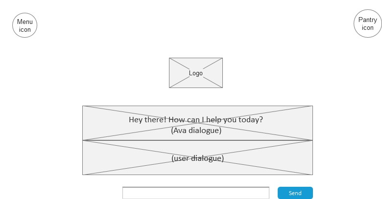
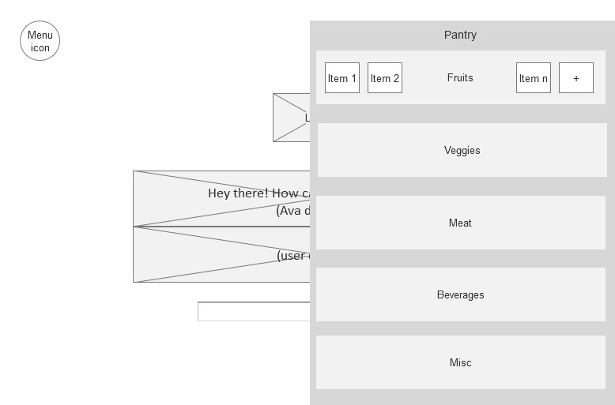
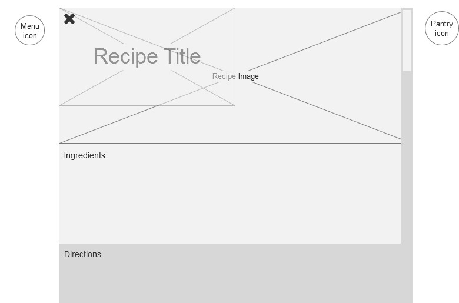
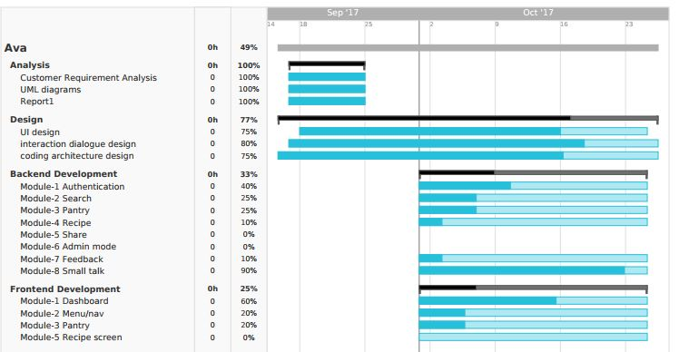

## AVA

### Table of contents  

**[Introduction](#introduction)**

**[Interaction Diagrams](#interactiondiagrams)**

**[Class Diagram and Interface Specification]()**

* [Class Diagram](#classdiagram)
* [Data Types and Operation Signatures](#datatypesandstructures)

**[System Architecture and System Design](#systemdesign)**

* [Architectural Styles](#architecturalstyles)
* [Identifying Subsystems](#identifyingsystems)
* [Mapping Subsystems to Hardware](#hardwaremappings)
* [Persistent Data Storage](#datastorage)
* [Network Protocol](#networkprotocol)
* [Global Control Flow](#controlflow)
* [Hardware Requirements](#hardwarerequirements)

**[Algorithms and Data Structures](#algorithmsandstructures)**

* [Algorithms](#algorithms)
* [Data Structures](#datastructures)

**[User Interface Design and Implementation](#uidesign)**

**[Progress Report and Plan of Work](#progress)**

* [Progress Report](#progressreport)
* [Plan of Work](#planofwork)
* [Breakdown of Responsibilities](#breakdown)

**[References](#references)**

##  Introduction

During the course of the semester, team friday has been working on an idea called Ava which is an online cooking assistant that acts as a personal sous Chef to help the users decide what they can eat for breakfast, lunch, and dinner—and how to make it with the ingredients they have at home.

Our goal is to provide the user with a simple, quick, and powerful resource for discovering recipes. This system is mainly to help people who struggle with cooking, whether they have a busy schedule and do not have the time to experiment with their own ingredients or they just find cooking a challenge or a frustrating experience.Users can list down or create a pantry to store the ingredients they have in order to find the recipe that suite their taste.  

From the admin perspective, we offer a search option for customer to find recipe as per their favourite cuisine based on the time of day with the ingredients they have. We also provide a feedback option where users can give their comments on our system so that we can offer a more effective site.

We have included the primary use cases below to illustrate how easy it is for users to use our system.

##  Interaction Diagrams

####Use Case 1: Login
In order for users to log-in, the user will send an authentication request by logging in through the Ava front-end service. From there, the request will be verified through the database back-end. If successful, then the user may use various perks of being a user of this service.

####Use Case 2: Input Ingredients
Users may enter ingredients through the Ava chat box, which will be sent through to the back-end database. From there, the database will store this information and it will be represented to the user as ingredients in the "Pantry". 

####Use Case 3: Search Ingredients
Users will be able to search for recipes based on ingredients in the pantry, cultural origin of the cuisine, and time of day food is typically eaten. The request is sent through the Ava front-end chat box, then the queries are against the recipes in the database. From there, the most relevant recipe will be sent back to the front-end for viewing by the user.

##  Class diagram
This is the planned implementation of the classes in Object-Oriented Programming  fashion. This implementation is meant to be both functional as well as efficient.

=======

##  System Architecture and system design

#### Architectural Styles

##### Client-server (Distributed application)

The **client–server model** is a distributed application structure that partitions tasks or workloads between the providers of a resource or service, called servers, and service requesters, called clients. Often clients and servers communicate over a computer network on separate hardware, but both client and server may reside in the same system. A server host runs one or more server programs which share their resources with clients. A client does not share any of its resources, but requests a server's content or service function. Clients therefore initiate communication sessions with servers which await incoming requests.

##### Server-side internal architecture

##### Major system services :

- User Authentication 
- User Pantry Management
- User Profile
- Recipe Search 
- Recipe Ratings and Feedback

  In general, a service is an abstraction of computer resources and a client does not have to be concerned with how the server performs while fulfilling the request and delivering the response. The client only has to understand the response based on the well-known application protocol, i.e. the content and the formatting of the data for the requested service.

#### Identifying subsystems

##### Subsystems

* Front End
* Application Server
* Database

#### Data Storage

The system works with multiple storage strategies for different forms of data. For persistent data storage, the system uses *PostgreSQL*, an object-relational database management system (ORDBMS) with an emphasis on extensibility and standards compliance.  PostgreSQL is developed by the PostgreSQL Global Development Group, a diverse group of many companies and individual contributors. It is free and open-source, released under the terms of the PostgreSQL License, a permissive software license.

The major differences between conventional RDBMS services, MySQL and PostgreSQL are as below: 

######**1. Partitioning**

MySQL and PostgreSQL differ significantly with respect to their partitioning methods, which determine how data is stored on different nodes of the database. MySQL uses a proprietary technology called MySQL Cluster to perform horizontal clustering, which consists of creating multiple clusters with a single cluster instance within each node. PostgreSQL doesn’t implement true partitioning, although it can provide a similar capability with table inheritance. This task involves using a separate sub-table to control each “partition.”

######**2. Replication**

A database may use multiple methods to store redundant data across multiple nodes. MySQL uses master-master replication, in which each node can update the data. Both MySQL and PostgreSQL can perform master-slave replication, where one node controls the storage of data by the other nodes. PostgreSQL can also handle other types of replication with the implementation of third-party extensions.

#### Network Protocol

Clients and servers exchange messages in a request–response messaging pattern. The client sends a request, and the server returns a response. This exchange of messages is an example of inter-process communication. To communicate, the computers must have a common language, and they must follow rules so that both the client and the server know what to expect. The language and rules of communication are defined in a communications protocol. All client-server protocols operate in the application layer. The application layer protocol defines the basic patterns of the dialogue. To formalize the data exchange even further, the server implements an application programming interface (API). The API is an abstraction layer for accessing a service. By restricting communication to a specific content format, it facilitates parsing. By abstracting access, it facilitates cross-platform data exchange via HTTP. 

#### Global Control Flow
The global control flow shows how users will access the website, in a step-by-step diagram. The red lines show that the user has two separate options in this flow chart.

#### Hardware Requirements

The Ava website will not require any high-end devices. It only will require a hardware with stable internet access. Therefore, system interaction will require:

* A client device which can access internet [personal computer, laptop, smartphone]
* Web Browser
* Internet Connection

##  Algorithms and Data Structures

#### Algorithms

##### Hamming distance algorithm for ingredients matching

All the ingredients are identified by unique id-weight. Each recipe has an  ingredient score based on the ingredients and keywords associated to it, such as time-of-day and cultural origin. 

To get list of recipes, hamming distance between the query ingredients or ingredients in the user pantry will be used to determine relative relevancy. 

 

#### Data Structures

Data structures used :

* Lists
* Dictionary (key, value pair)
* JSON objects
* Defined Objects (User, Pantry, Recipe, Feedback)

These were used with intention of flexibility in the design of AVA. AVA is meant to have multiple uses, as well as tend towards using object-oriented programming in order to be more efficient with resources. This also includes a small image which will act as the main logo of the Ava project.
  ​

##  User Interface Design and Implementation

There are three pages in which the user will be able to access on this iteration of Ava. The pages implemented below are deemed necessary to utilize all of Ava's resources, as well as be a simplistic design that does not overcrowd.

###Dashboard
The Dashboard is the home page in which the user first accesses. There is room for a chat box for text input, as well as several links to other functions of the web page.

###Pantry Panel
The Pantry Panel is a pop-up API which will allow users to checkbox the items they wish to input into their Pantry. This is the front-end implementation which will tell the database the ingredients a user will like to search recipes with.

###Recipe Page
The Recipe Page is a pop-up box which will show the recipe that best fits the user's query. The user may exit the box as shown in the top left, for easy navigation. The pop-up has three main sections, the recipe image, the recipe ingredients, as well as the recipe directions.

##  Progress

#### Progress report
This is the bar diagram of the development of Ava. The beginning stages of development occurred in early to late September in order to establish the concepts and implementation of the web page. As shown below, the back-end and front-end development, which will take the majority of resources, has been the subject of development starting from the beginning of October.

###  Plan of work

| Section              | Modules                                  | Deadline |
| -------------------- | ---------------------------------------- | -------- |
| Analysis             | Customer Requirement Analysis            | Oct 12   |
|                      | UML diagrams                             | Oct 12   |
|                      | Report1                                  | Oct 12   |
| Design               | UI Design                                | Oct 23   |
|                      | Interaction dialogue design              | Oct 23   |
|                      | coding architecture design               | Oct 23   |
| Backend Development  | Module-1 AuthenticationBackend development | Nov 7    |
|                      | Module-2 Search                          | Nov 7    |
|                      | Module-3 Pantry                          | Nov 7    |
|                      | Module-4Recipe                           | Nov 7    |
|                      | Module5-Share                            | Nov 7    |
|                      | Module6-Admin mode                       | Nov 7    |
|                      | Module7-Feedback                         | Nov 7    |
|                      | Module8-Small talk                       | Nov 7    |
| Frontend development | Module1-Dashboard                        | Nov 6    |
|                      | Module2-Menu/nav                         | Nov 6    |
|                      | Module3-Pantry                           | Nov 6    |
|                      | Module4-Receipe screen                   | Nov 6    |

#### Breakdown of Responsibilities

Since the development of this project will take many resources and can be code-heavy and takes a significant amount of analysis, the APIs have been broken up and divided amongst the team members. This is the breakdown of which team member is developing which API. As shown below, the team has broken up into two entities in order to split who develop front-end and back-end.

* Backend APIs:
  * Recipe Search: Swapnil
  * Authentication: Neha
  * Feedback: Vidhya
  * Pantry: Sruthi, Angelica
  * Registration: Anand
* Frontend: Parker, Swapnil, Anand

#### References

* Documentation of PostgreSQL: https://wiki.postgresql.org/wiki/Main_Page

* Report 2 Guidelines: https://csus-csc-131-fall2017.github.io/Course-Repo/report2.html